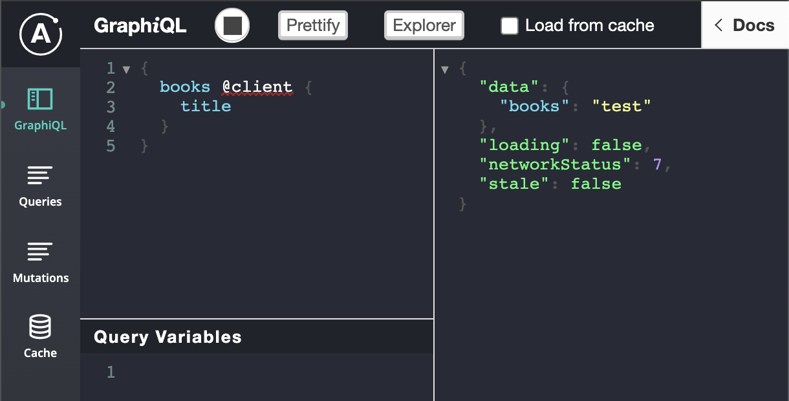

# apollo-mocked-example

## Start Server
```
cd server
yarn
node app.js
```

## Start Client
```
cd client
yarn
yarn start
```

## How to test
When you run the Client, it requests two queries. One query is the normal request to compare against, and the second query is the mocked request.

Here's the output of both.

**Normal**
```
{
  "data": {
    "books": [
      {
        "__typename": "Book",
        "title": "Harry Potter and the Sorcerer's stone"
      },
      {
        "__typename": "Book",
        "title": "Jurassic Park"
      }
    ]
  },
  "loading": false,
  "networkStatus": 7
}
```


**Mocked**
```
{
  "data": {
    "books": "test"
  },
  "loading": false,
  "networkStatus": 7
}
```

### Dev Tools
You can run the [Apollo Devtools](https://chrome.google.com/webstore/detail/apollo-client-developer-t/jdkknkkbebbapilgoeccciglkfbmbnfm) and build a query with a graphiql interface.





